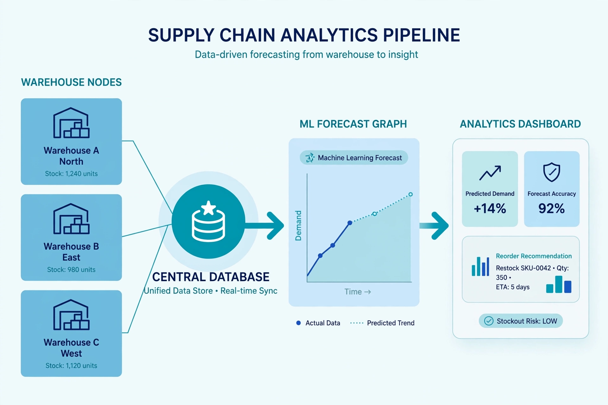

# 📦 NovaMart Supply Chain Intelligence Platform: End-to-End Analytics and Demand Forecasting



_Turning scattered supply chain data into forecasted demand and measurable operational performance, built to mirror how a real retail analytics team actually works._

---

## 🧩 Overview

**NovaMart Supply Chain Intelligence Platform** is an end-to-end analytics project simulating the data infrastructure of a mid-size US retail company. NovaMart sources products from 8 international suppliers, stores inventory across 3 warehouses (Charlotte, Atlanta, Dallas), and fulfills customer orders nationwide.

The project builds the full analytics stack a Supply Chain Analyst or Data Analyst would own at a real company: raw data generation, a star-schema data warehouse, SQL analytics with window functions, a machine learning demand forecasting model, and a live three-page Power BI dashboard.

**Live Dashboard:** [View the Power BI Dashboard](https://app.powerbi.com/links/sG1gVhLLIL?ctid=88d59d7d-aecb-41b2-90c5-55595de02536&pbi_source=linkShare)

---

## 🎯 The Problem

> How do you give a retail operations team one trustworthy view of revenue, supplier reliability, and inventory health, and get ahead of demand instead of reacting to it?

Before this project, NovaMart's data lives as disconnected reactive processes: management has no single view of revenue trends, no visibility into which suppliers cause delivery delays, inventory is restocked on a fixed schedule regardless of actual demand, and warehouse performance is tracked in spreadsheets with no benchmarking against the other locations. This project replaces that with a warehouse-backed analytics layer and a forecasting model that predicts demand before it happens.

---

## 💡 Motivation

Anyone can build a dashboard on top of a clean spreadsheet. A stronger signal for a hiring manager is proof that someone can design the data model underneath the dashboard, write the SQL that actually answers business questions, and know when a metric like MAPE is misleading enough that a different metric should carry the conclusion.

This project was built to demonstrate that full range: schema design, SQL analytics, and machine learning forecasting, joined into one coherent operational story rather than three disconnected exercises.

---

## 🧬 Core Idea

The pipeline follows a standard analytics engineering progression, from raw data to a forecasted, dashboarded business view:

1. **Generate** two years of realistic supply chain data with seasonality built in (Python, pandas, numpy)
2. **Model** the data into a star schema warehouse with fact and dimension tables (SQLite)
3. **Analyze** with SQL window functions and conditional aggregation to answer 8 core business questions
4. **Forecast** daily product demand 90 days ahead using a Random Forest model with engineered lag and rolling features (scikit-learn)
5. **Visualize** revenue, operations, and forecasts for stakeholders in a three-page Power BI dashboard

---

## 🧠 Why It Matters

- Demonstrates the full data model to insight pipeline: schema design, SQL analytics, machine learning, and BI, in one coherent project rather than isolated exercises.
- The forecasting model is validated with a time-based train and test split, never a random shuffle, which is the correct way to evaluate a time series model and avoids leaking future information into training.
- Business rules (cancelled orders contribute zero revenue, stockouts flagged at zero inventory) are encoded once in the warehouse layer, so every downstream report inherits them automatically instead of every analyst recalculating them differently.

---

## 🧰 Tools and Technologies

| Category                     | Stack                                                       |
| ---------------------------- | ----------------------------------------------------------- |
| **Language**                 | Python 3.12                                                 |
| **Data Manipulation**        | pandas, numpy                                               |
| **Database and Warehousing** | SQLite, star schema (fact and dimension modeling)           |
| **SQL Techniques**           | Window functions (LAG, RANK), CTEs, conditional aggregation |
| **Machine Learning**         | scikit-learn (RandomForestRegressor)                        |
| **Business Intelligence**    | Power BI Desktop                                            |
| **Version Control**          | Git, GitHub                                                 |

---

## 🧩 Methodology

### Phase 1. Data Generation

Generated two years (2023 to 2024) of realistic NovaMart data across 5 tables: 8 suppliers, 50 products across 5 categories, 3 warehouses, 44,106 orders, and 109,500 daily inventory snapshots.

A monthly seasonality multiplier drives order volume to simulate real retail demand: November runs at 1.6x baseline and December at 1.8x to simulate the holiday spike, while January drops to 0.7x for the post-holiday slowdown. This is the exact pattern the forecasting model in Phase 4 has to learn to predict.

### Phase 2. Data Warehouse and Star Schema

Built a star schema with 2 fact tables and 4 dimension tables:

```
                    dim_suppliers
                         |
dim_date -- fact_orders -- dim_products
                |
           dim_warehouses
                |
          fact_inventory
```

- `fact_orders`: one row per order, storing measures plus foreign keys to date, product, and warehouse
- `fact_inventory`: daily stock snapshots with `days_of_supply` and `stockout_flag`
- `dim_date`: pre-computed date attributes (year, quarter, month, week, is_weekend) enabling instant time-intelligence queries
- `dim_products`: product catalog with a calculated `margin_pct` column
- `dim_suppliers`: supplier master data with reliability metrics
- `dim_warehouses`: warehouse locations and capacity

A star schema was chosen specifically because it is the pattern every major BI tool, Power BI, Tableau, Looker, is built around: separating measurable facts from descriptive context keeps analytical queries fast even as data volume grows.

### Phase 3. SQL Analytics Layer

Wrote 8 KPI queries against the warehouse, each answering a specific operational question:

| KPI                   | SQL Technique               | Business Question                          |
| --------------------- | --------------------------- | ------------------------------------------ |
| Monthly revenue trend | `LAG()` window function     | How is revenue growing month over month?   |
| On-time delivery rate | `CASE WHEN` aggregation     | Which warehouses are underperforming?      |
| Supplier scorecard    | `RANK()` window function    | Which suppliers cause the most delays?     |
| Inventory turnover    | Multi-table join and ratio  | Which products are overstocked?            |
| Stockout analysis     | Flag filtering              | Where are sales being lost to stockouts?   |
| Category quarterly    | Pivot with `CASE WHEN`      | Which categories peak in which season?     |
| Top 10 products       | `RANK()` and join           | What are the best revenue-generating SKUs? |
| Warehouse comparison  | `GROUP BY` and derived KPIs | How do the 3 distribution centers compare? |

### Phase 4. Demand Forecasting with Machine Learning

Built a Random Forest model to predict daily units sold per product, engineered from lag and rolling-average features:

| Feature               | Description                                |
| --------------------- | ------------------------------------------ |
| lag_7, lag_14, lag_30 | Units sold 7, 14, and 30 days prior        |
| rolling_7, rolling_30 | 7-day and 30-day rolling average demand    |
| month, week_number    | Captures seasonal and sub-monthly patterns |
| base_demand           | Product's inherent baseline popularity     |

**Model:** Random Forest Regressor, 100 trees, max depth 12
**Train set:** January 2023 to September 2024 (18,952 rows)
**Test set:** October to December 2024, the holiday season (3,512 rows)
**Split method:** Time-based, not a random shuffle, since a random split on time series data leaks future information into training and produces misleadingly optimistic results

### Phase 5. Power BI Dashboard

A three-page interactive dashboard built on the warehouse and forecast outputs:

- **Revenue Overview**: monthly revenue trend, KPI cards ($59.17M total revenue, 44,106 orders), revenue by category, top 10 products by margin and rank
- **Supply Chain Operations**: warehouse revenue comparison, fulfillment rate by warehouse, supplier performance scorecard ranked by delay rate, inventory health status
- **Demand Forecast**: 90-day forecast by category, model accuracy KPI cards, feature importance chart, top products by forecasted demand

---

## 📊 Model Performance

| Metric | Value           | What It Means                                                                          |
| ------ | --------------- | -------------------------------------------------------------------------------------- |
| MAE    | 11.03 units/day | Average prediction error, the metric that matters most for restocking decisions        |
| RMSE   | 15.99 units/day | Penalizes large errors more heavily than MAE                                           |
| MAPE   | 78.6%           | Inflated by intermittent low-volume demand days; not the primary metric relied on here |

**A note on MAPE:** on days where a product sells only 1 or 2 units at a given warehouse, even a small absolute miss produces a huge percentage error, which is exactly what happened here. MAE of 11 units per day is the metric that actually reflects forecast usefulness for restocking, and it is the one this project relies on.

**Feature importance:** `rolling_7` alone accounts for 39.7% of the model's predictive power, meaning recent sales momentum is by far the strongest demand signal, well ahead of `rolling_30` (15.2%) and `month` (11.7%). The model correctly learned to weight recent behavior over long-term averages or static seasonality alone.

---

## 🔍 Key Findings

| Finding                                                                 | Evidence                                                                                                             |
| ----------------------------------------------------------------------- | -------------------------------------------------------------------------------------------------------------------- |
| All 3 warehouses fall below the 90% on-time delivery industry benchmark | Atlanta 85.1%, Charlotte 84.9%, Dallas 84.5%                                                                         |
| DeltaSource Inc. (Vietnam) is the highest-risk supplier                 | 10.5% delay rate, 25-day average lead time, the longest and least reliable of all 8 suppliers                        |
| 42 of 50 products are flagged as overstocked                            | Fixed 14-day restock cycles ignore actual per-product demand signals                                                 |
| Q4 drives a disproportionate share of annual revenue                    | Holiday season seasonality multipliers (1.6x November, 1.8x December) concentrate demand sharply in the last quarter |

---

## 🎨 Dashboards

**Power BI:** [NovaMart Supply Chain Dashboard](https://app.powerbi.com/links/sG1gVhLLIL?ctid=88d59d7d-aecb-41b2-90c5-55595de02536&pbi_source=linkShare)

- Page 1, Revenue Overview: trend lines, KPI cards, category and top-product breakdowns
- Page 2, Supply Chain Operations: warehouse comparison, supplier scorecard, inventory health
- Page 3, Demand Forecast: 90-day forecast by category, model accuracy, feature importance

---

## 🧠 Architectural Decisions and Tradeoffs

- **Star schema over a single flat table**: trades some upfront modeling effort for materially faster analytical queries and a structure every major BI tool expects natively.
- **Business rules encoded once in the warehouse layer**: cancelled orders are set to zero revenue and stockouts are flagged directly in `fact_inventory`, so every downstream report and dashboard inherits consistent logic instead of each analyst reimplementing it slightly differently.
- **Time-based train and test split for the forecasting model**: a random shuffle would have let the model see future data during training, producing an artificially strong but meaningless accuracy score. Splitting strictly by date, and testing specifically on the holiday season, gives an honest read on how the model performs under the hardest, highest-stakes conditions.
- **MAE prioritized over MAPE as the headline accuracy metric**: MAPE looked dramatically worse than the model's actual usefulness because of low-volume, intermittent-demand days. Choosing the metric that reflects real restocking decisions, rather than the one that is easiest to report, is a deliberate analytical judgment call documented here rather than glossed over.

---

## ⚠️ Limitations and Future Directions

- The forecasting model is trained per product using shared features rather than one model per product; a hierarchical or per-category model could improve accuracy for high-volume SKUs.
- MAPE's sensitivity to low-volume days suggests a weighted or intermittent-demand-specific metric, such as weighted MAPE, would be a more honest secondary metric for future iterations.
- Inventory restocking logic is currently a fixed 14-day cycle in the simulated raw data; a natural next step is feeding the forecasted demand back into a dynamic reorder-point calculation rather than only flagging overstocked SKUs after the fact.
- The warehouse currently runs on SQLite for portability; a production version would move to a cloud warehouse such as Snowflake or BigQuery to support concurrent access and larger data volumes.

---

## 🛠️ How to Run

```bash
# 1. Clone the repo
git clone https://github.com/nagahemaramishetty/NovaMart-supply-chain-analysis
cd NovaMart-supply-chain-analysis

# 2. Install dependencies
pip install pandas numpy scikit-learn openpyxl

# 3. Generate raw data
python generate_data.py

# 4. Build the data warehouse
python create_warehouse.py

# 5. Run SQL analytics
python analytics.py

# 6. Train the ML model and generate the forecast
python demand_forecast.py
```

Open `NovaMart_PowerBI_Data.xlsx` in Power BI Desktop to explore the dashboard.

---

## 👩‍💻 Author

**Naga Hema Ramishetty**
Data Analyst
**GitHub:** [github.com/nagahemaramishetty](https://github.com/nagahemaramishetty)

---

## 🧭 Keywords

`SQL` · `Star-Schema` · `Data-Warehousing` · `Python` · `pandas` · `scikit-learn` · `Machine-Learning` · `Demand-Forecasting` · `Random-Forest` · `Power-BI` · `Business-Intelligence` · `Supply-Chain-Analytics` · `Data-Analyst-Portfolio`

---

_This repository demonstrates that a trustworthy forecast starts with a trustworthy data model. Every number here is backed by a validated warehouse, tested SQL, and a properly evaluated machine learning model._
